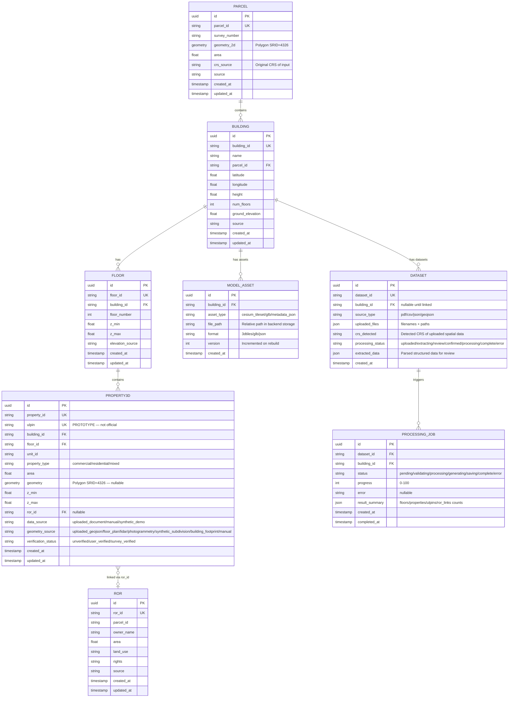
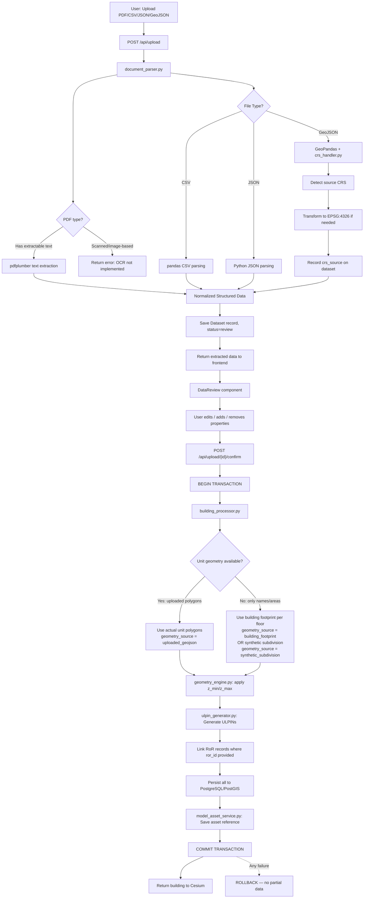
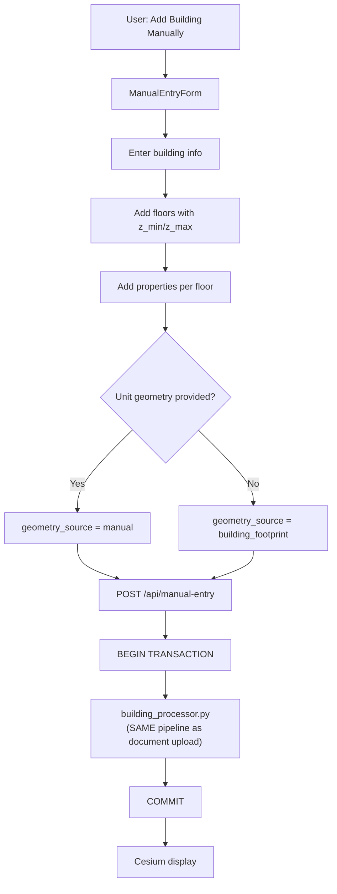
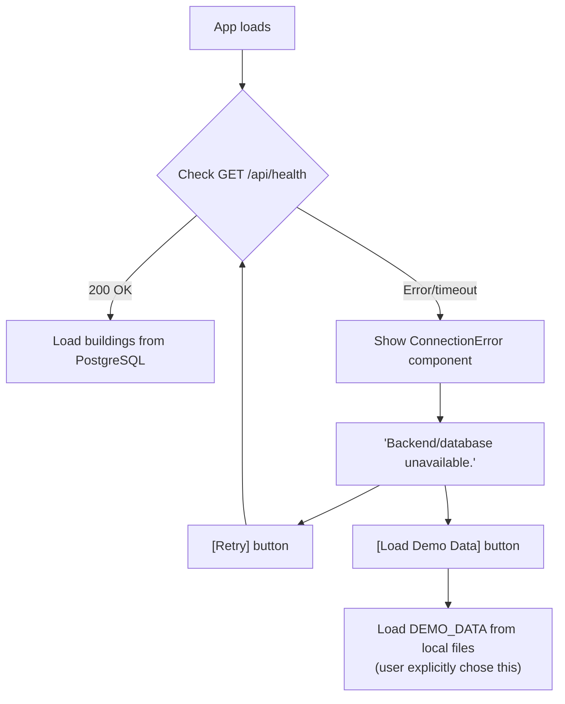
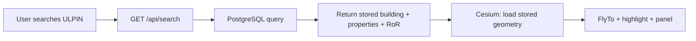

# Implementation Plan v2 — Data-Driven 3D Building Modeling Prototype

> Evolving from M1 frontend-only demo → full PostgreSQL/PostGIS-backed data-driven 3D cadastral system
>
> **v2 changes:** All 10 user corrections incorporated. Open questions resolved.

---

## Existing Codebase Inspection Results

### ✅ Verified Infrastructure

| Component | Status | Details |
|-----------|--------|---------|
| PostgreSQL | ✅ Connected | PostgreSQL 18.6, `ulpin_db` |
| PostGIS | ✅ Available | 3.6.2 with GEOS 3.14.1 |
| Existing tables | Empty | Only `spatial_ref_sys` (PostGIS default) |
| SQLAlchemy | ✅ Installed | 2.0.52 |
| GeoAlchemy2 | ✅ Installed | 0.20.0 |
| psycopg2 | ✅ Installed | 2.9.12 |
| FastAPI | ✅ Installed | 0.141.1 (stub `/health` only) |
| DATABASE_URL | ✅ Configured | `backend/.env` → `ulpin_db` |
| GeoPandas | ✅ Installed | 1.1.4 |
| Shapely | ✅ Installed | 2.1.2 |
| Rasterio | ✅ Installed | 1.5.1 |

### Existing Components to REUSE (Not Replace)

| Component | File | Reuse Strategy |
|-----------|------|----------------|
| React entry | [main.jsx](file:///d:/SIH26-%203D%20ULPIN%20Generation%20and%20vertical%20Property%20Mapping%20System/frontend/src/main.jsx) | Keep as-is |
| App root | [App.jsx](file:///d:/SIH26-%203D%20ULPIN%20Generation%20and%20vertical%20Property%20Mapping%20System/frontend/src/App.jsx) | Keep, add modal rendering |
| SelectionProvider | [useSelection.jsx](file:///d:/SIH26-%203D%20ULPIN%20Generation%20and%20vertical%20Property%20Mapping%20System/frontend/src/hooks/useSelection.jsx) | Keep, extend if needed |
| Dashboard layout | [Dashboard.jsx](file:///d:/SIH26-%203D%20ULPIN%20Generation%20and%20vertical%20Property%20Mapping%20System/frontend/src/pages/Dashboard.jsx) | Keep as main view |
| Navbar | [Navbar.jsx](file:///d:/SIH26-%203D%20ULPIN%20Generation%20and%20vertical%20Property%20Mapping%20System/frontend/src/components/Navbar.jsx) | Keep, add navigation |
| SearchBar | [SearchBar.jsx](file:///d:/SIH26-%203D%20ULPIN%20Generation%20and%20vertical%20Property%20Mapping%20System/frontend/src/components/SearchBar.jsx) | Extend to search DB |
| Sidebar | [Sidebar.jsx](file:///d:/SIH26-%203D%20ULPIN%20Generation%20and%20vertical%20Property%20Mapping%20System/frontend/src/components/Sidebar.jsx) | Enable processing buttons |
| LayerControl | [LayerControl.jsx](file:///d:/SIH26-%203D%20ULPIN%20Generation%20and%20vertical%20Property%20Mapping%20System/frontend/src/components/LayerControl.jsx) | Keep as-is |
| PropertyPanel | [PropertyPanel.jsx](file:///d:/SIH26-%203D%20ULPIN%20Generation%20and%20vertical%20Property%20Mapping%20System/frontend/src/components/PropertyPanel.jsx) | Extend for new fields |
| ValidationPanel | [ValidationPanel.jsx](file:///d:/SIH26-%203D%20ULPIN%20Generation%20and%20vertical%20Property%20Mapping%20System/frontend/src/components/ValidationPanel.jsx) | Keep as-is |
| CesiumViewer | [CesiumViewer.jsx](file:///d:/SIH26-%203D%20ULPIN%20Generation%20and%20vertical%20Property%20Mapping%20System/frontend/src/cesium/CesiumViewer.jsx) | Extend to load DB buildings |
| Cesium parcels | [parcels.js](file:///d:/SIH26-%203D%20ULPIN%20Generation%20and%20vertical%20Property%20Mapping%20System/frontend/src/cesium/parcels.js) | Keep as-is |
| Cesium buildings | [buildings.js](file:///d:/SIH26-%203D%20ULPIN%20Generation%20and%20vertical%20Property%20Mapping%20System/frontend/src/cesium/buildings.js) | Extend for DB buildings |
| Cesium floors | [floors.js](file:///d:/SIH26-%203D%20ULPIN%20Generation%20and%20vertical%20Property%20Mapping%20System/frontend/src/cesium/floors.js) | Extend for per-unit geometry |
| Cesium underground | [underground.js](file:///d:/SIH26-%203D%20ULPIN%20Generation%20and%20vertical%20Property%20Mapping%20System/frontend/src/cesium/underground.js) | Keep as-is |
| Cesium utils | [utils.js](file:///d:/SIH26-%203D%20ULPIN%20Generation%20and%20vertical%20Property%20Mapping%20System/frontend/src/cesium/utils.js) | Keep, extend colors |
| API service | [api.js](file:///d:/SIH26-%203D%20ULPIN%20Generation%20and%20vertical%20Property%20Mapping%20System/frontend/src/services/api.js) | Switch to `fetch()` calls, explicit error handling |
| Validation service | [validation.js](file:///d:/SIH26-%203D%20ULPIN%20Generation%20and%20vertical%20Property%20Mapping%20System/frontend/src/services/validation.js) | Keep for client-side checks |
| Design tokens | [index.css](file:///d:/SIH26-%203D%20ULPIN%20Generation%20and%20vertical%20Property%20Mapping%20System/frontend/src/index.css) | Keep design system |
| Component styles | [App.css](file:///d:/SIH26-%203D%20ULPIN%20Generation%20and%20vertical%20Property%20Mapping%20System/frontend/src/App.css) | Extend for new components |
| Sample data (6 files) | `frontend/src/data/*` | Keep for dev/testing only; NOT silent fallback |
| Backend FastAPI app | [main.py](file:///d:/SIH26-%203D%20ULPIN%20Generation%20and%20vertical%20Property%20Mapping%20System/backend/app/main.py) | Extend with routers |
| Backend .env | [.env](file:///d:/SIH26-%203D%20ULPIN%20Generation%20and%20vertical%20Property%20Mapping%20System/backend/.env) | Reuse DATABASE_URL |
| Vite config | [vite.config.js](file:///d:/SIH26-%203D%20ULPIN%20Generation%20and%20vertical%20Property%20Mapping%20System/frontend/vite.config.js) | Add proxy for API |

### What Does NOT Exist Yet (Must Create)

- No SQLAlchemy models
- No database session/engine configuration module
- No API routers (only stub `main.py`)
- No document upload endpoint
- No document parsing service
- No manual entry interface
- No 3D generation engine
- No ULPIN generation service
- No model asset storage directory
- No Alembic migrations

---

## Database Schema (8 ORM Models)



### Key Constraints & Design Decisions

- `PROPERTY3D.ulpin` — **UNIQUE** (prototype ULPIN uniqueness)
- `PROPERTY3D.property_id` — **UNIQUE**
- `BUILDING.building_id` — **UNIQUE**
- `PARCEL.parcel_id` — **UNIQUE**
- All geometry fields use **PostGIS Geometry(Polygon, 4326)** — stored in EPSG:4326 regardless of source CRS
- `PROPERTY3D.geometry` is **NULLABLE** — geometry may not be available for every unit
- `PROPERTY3D.geometry_source` tracks provenance (real vs synthetic vs approximate)
- `PROPERTY3D.data_source` tracks how the property data was created
- `PROPERTY3D.ror_id` is **NULLABLE** — some properties may lack RoR records
- All tables use **UUID** primary keys for future-proofing
- `created_at` / `updated_at` on all mutable tables
- No automatic table drops; safe `CREATE TABLE IF NOT EXISTS` strategy

---

## Backend Architecture

### New Backend File Structure

```
backend/
├── app/
│   ├── main.py                    # [MODIFY] Add CORS, routers, startup
│   ├── config.py                  # [NEW] Settings from .env
│   ├── database.py                # [NEW] SQLAlchemy engine + session
│   ├── models/
│   │   ├── __init__.py            # [NEW] Export all 8 models
│   │   ├── parcel.py              # [NEW] Parcel ORM
│   │   ├── building.py            # [NEW] Building ORM
│   │   ├── floor.py               # [NEW] Floor ORM
│   │   ├── property3d.py          # [NEW] Property3D ORM
│   │   ├── ror.py                 # [NEW] RoR ORM
│   │   ├── dataset.py             # [NEW] Dataset ORM
│   │   ├── processing_job.py      # [NEW] ProcessingJob ORM
│   │   └── model_asset.py         # [NEW] ModelAsset ORM
│   ├── schemas/
│   │   ├── __init__.py            # [NEW]
│   │   ├── building.py            # [NEW] Pydantic request/response schemas
│   │   ├── property.py            # [NEW]
│   │   └── common.py              # [NEW] Shared schemas
│   ├── routers/
│   │   ├── __init__.py            # [NEW]
│   │   ├── health.py              # [NEW] /api/health, /api/health/db
│   │   ├── buildings.py           # [NEW] CRUD + search
│   │   ├── properties.py          # [NEW] Property queries
│   │   ├── upload.py              # [NEW] Document upload + ingestion
│   │   └── manual_entry.py        # [NEW] Manual building/property entry
│   ├── services/
│   │   ├── __init__.py            # [NEW]
│   │   ├── document_parser.py     # [NEW] PDF/CSV/JSON/GeoJSON parsing
│   │   ├── building_processor.py  # [NEW] Normalized data → DB (transactional)
│   │   ├── geometry_engine.py     # [NEW] 2D polygon → 3D volume + subdivision
│   │   ├── ulpin_generator.py     # [NEW] Deterministic ULPIN
│   │   ├── crs_handler.py         # [NEW] CRS detection + transformation
│   │   └── model_asset_service.py # [NEW] Model asset file storage + DB reference
│   └── init_db.py                 # [NEW] Create tables (no Alembic yet)
├── storage/
│   ├── uploads/                   # [NEW] Uploaded raw documents
│   └── models/                    # [NEW] Generated model asset files
├── .env                           # [EXISTS] DATABASE_URL configured
└── requirements.txt               # [MODIFY] Add new dependencies
```

### New API Endpoints

| Method | Endpoint | Purpose |
|--------|----------|---------|
| `GET` | `/api/health` | Basic health |
| `GET` | `/api/health/db` | PostgreSQL + PostGIS verification (no credentials exposed) |
| `GET` | `/api/buildings` | List all buildings |
| `GET` | `/api/buildings/{building_id}` | Get building with floors + properties |
| `POST` | `/api/buildings` | Create building via manual entry |
| `GET` | `/api/buildings/{building_id}/properties` | Properties for a building |
| `GET` | `/api/properties/{ulpin}` | Get property by ULPIN |
| `GET` | `/api/properties/{ulpin}/ror` | Get linked RoR record |
| `GET` | `/api/search?q=...` | Search by ULPIN, building_id, property_id, name |
| `POST` | `/api/upload` | Upload document (PDF/CSV/JSON/GeoJSON) |
| `GET` | `/api/upload/{dataset_id}/review` | Get extracted data for review |
| `PUT` | `/api/upload/{dataset_id}/review` | Edit extracted data before confirm |
| `POST` | `/api/upload/{dataset_id}/confirm` | Confirm → transactional 3D generation → persist |
| `POST` | `/api/manual-entry` | Submit complete manual building + floors + properties |
| `GET` | `/api/buildings/{building_id}/model-asset` | Get model asset reference |

---

## Frontend Changes

### New Frontend Components

```
frontend/src/
├── components/
│   ├── AddBuildingModal.jsx       # [NEW] "Add New Building" choice modal
│   ├── DocumentUpload.jsx         # [NEW] File upload interface
│   ├── DataReview.jsx             # [NEW] Extracted data review/edit screen
│   ├── ManualEntryForm.jsx        # [NEW] Manual building/floor/property entry
│   ├── ProcessingStatus.jsx       # [NEW] Processing progress display
│   ├── BuildingList.jsx           # [NEW] List of buildings in DB
│   ├── ConnectionError.jsx        # [NEW] Backend unavailable error + Retry/Demo buttons
│   ├── GeometryBadge.jsx          # [NEW] Shows geometry_source provenance indicator
│   └── (existing components)      # [KEEP] All existing components preserved
```

### Frontend Modifications

| File | Change |
|------|--------|
| [api.js](file:///d:/SIH26-%203D%20ULPIN%20Generation%20and%20vertical%20Property%20Mapping%20System/frontend/src/services/api.js) | Switch to `fetch()` calls. On API failure: throw explicit error (NOT silent DEMO fallback). Add separate `loadDemoData()` function only invoked by user action. |
| [Sidebar.jsx](file:///d:/SIH26-%203D%20ULPIN%20Generation%20and%20vertical%20Property%20Mapping%20System/frontend/src/components/Sidebar.jsx) | Enable "Add Building" button → opens AddBuildingModal |
| [SearchBar.jsx](file:///d:/SIH26-%203D%20ULPIN%20Generation%20and%20vertical%20Property%20Mapping%20System/frontend/src/components/SearchBar.jsx) | Add backend search via `GET /api/search` |
| [CesiumViewer.jsx](file:///d:/SIH26-%203D%20ULPIN%20Generation%20and%20vertical%20Property%20Mapping%20System/frontend/src/cesium/CesiumViewer.jsx) | Load buildings from API. On error: show ConnectionError component. |
| [PropertyPanel.jsx](file:///d:/SIH26-%203D%20ULPIN%20Generation%20and%20vertical%20Property%20Mapping%20System/frontend/src/components/PropertyPanel.jsx) | Show `data_source`, `geometry_source`, `verification_status`, `property_type`. Display "Approximate Geometry" / "Synthetic Demo" badge when geometry_source is synthetic. |
| [App.css](file:///d:/SIH26-%203D%20ULPIN%20Generation%20and%20vertical%20Property%20Mapping%20System/frontend/src/App.css) | Add styles for new components (modals, forms, badges, error state) |
| [vite.config.js](file:///d:/SIH26-%203D%20ULPIN%20Generation%20and%20vertical%20Property%20Mapping%20System/frontend/vite.config.js) | Add proxy: `/api` → `http://localhost:8000` |

---

## Data Flow Architecture

### Document Upload Flow



### Manual Entry Flow



> [!IMPORTANT]
> **Both flows converge** at `building_processor.py` → same standardized data model → same transactional persistence → same Cesium display.

### Backend Unavailable Behavior



> [!WARNING]
> DEMO_DATA is NEVER loaded silently. The user must explicitly click `[Load Demo Data]` when the backend is unavailable. When PostgreSQL is working, it is the single source of truth.

### Query/View Flow (No Reprocessing)



---

## Property Geometry Provenance

### `geometry_source` Field Values

| Value | Meaning | UI Indicator |
|-------|---------|-------------|
| `uploaded_geojson` | Real geometry from uploaded GeoJSON | ✅ "Imported Geometry" |
| `floor_plan` | Geometry from floor plan upload | ✅ "Floor Plan Geometry" |
| `lidar` | Geometry from LiDAR processing | ✅ "LiDAR Geometry" |
| `photogrammetry` | Geometry from photogrammetry | ✅ "Photogrammetry Geometry" |
| `manual` | Geometry manually drawn/entered | ✅ "Manual Geometry" |
| `building_footprint` | Entire building footprint used as proxy | ⚠️ "Approximate — Building Footprint" |
| `synthetic_subdivision` | Auto-generated subdivision for demo | ⚠️ "Synthetic Subdivision — Demo Only" |

### UI Behavior

- **Real geometry** (`uploaded_geojson`, `floor_plan`, `lidar`, `photogrammetry`, `manual`): Displayed normally. Green badge in PropertyPanel.
- **Approximate geometry** (`building_footprint`, `synthetic_subdivision`): Displayed with amber warning badge. PropertyPanel shows "⚠ Approximate Geometry" or "⚠ Synthetic Demo Geometry". Never presented as real cadastral boundaries.

The `GeometryBadge.jsx` component renders the appropriate badge based on `geometry_source`.

---

## CRS Handling During Ingestion

### Flow

```
Uploaded spatial file (GeoJSON/GIS)
        ↓
crs_handler.py: detect source CRS
        ↓
    ┌───────────────────────────────────┐
    │ Source CRS detected?              │
    │                                   │
    │ Yes → record crs_source on Dataset│
    │       transform to EPSG:4326      │
    │       (pyproj Transformer)        │
    │                                   │
    │ No  → warn user, assume WGS84    │
    │       record crs_source = unknown │
    └───────────────────────────────────┘
        ↓
Store geometry in PostGIS as SRID=4326
```

### Implementation in `crs_handler.py`

- Use `pyproj.CRS` to parse/detect the CRS from GeoJSON `crs` field or `.prj` files
- Use `pyproj.Transformer` for coordinate transformation
- Record `crs_source` (original CRS) on the `Dataset` record
- All stored PostGIS geometry is always EPSG:4326
- Never silently misinterpret coordinates

---

## PDF Handling

### Detection Strategy

```
PDF uploaded
        ↓
pdfplumber.open(file)
        ↓
Extract text from all pages
        ↓
    ┌──────────────────────────────────────────┐
    │ Total extracted text > threshold?         │
    │                                           │
    │ Yes → proceed with structured parsing     │
    │                                           │
    │ No  → return error response:              │
    │       "This PDF appears to be scanned/    │
    │       image-based. Text extraction is not │
    │       possible. OCR processing is planned │
    │       for a future update."               │
    │                                           │
    │       Do NOT fabricate extracted data.     │
    └──────────────────────────────────────────┘
```

---

## Database Transactions

### Confirm/Process Operation

The `POST /api/upload/{dataset_id}/confirm` and `POST /api/manual-entry` endpoints must be **fully transactional**.

```python
# building_processor.py — process_building()

async def process_building(db: Session, building_data: dict) -> Building:
    """
    Transactional building processing.
    
    All-or-nothing: if any step fails, the entire operation
    rolls back. No partial buildings in the database.
    """
    try:
        # All operations within one transaction
        db.begin_nested()  # savepoint
        
        parcel = create_or_get_parcel(db, building_data["parcel"])
        building = create_building(db, building_data["building"], parcel)
        
        for floor_data in building_data["floors"]:
            floor = create_floor(db, floor_data, building)
            
            for prop_data in floor_data["properties"]:
                property3d = create_property(db, prop_data, building, floor)
                ulpin = generate_ulpin(property3d)
                property3d.ulpin = ulpin
                
                if prop_data.get("ror_id"):
                    link_ror(db, property3d, prop_data["ror_id"])
        
        save_model_asset_reference(db, building)
        
        db.commit()
        return building
        
    except Exception as e:
        db.rollback()
        raise ProcessingError(f"Building processing failed: {e}")
```

---

## Model Asset Storage

### Architecture

```
PostgreSQL (MODEL_ASSET table)
├── model_asset_id
├── building_id
├── asset_type      # "cesium_tileset" / "glb" / "metadata_json"
├── file_path       # "models/B01/v1/metadata.json"
├── format          # "json" / "glb" / "3dtiles"
├── version         # 1, 2, 3...
└── created_at

backend/storage/models/
├── B01/
│   └── v1/
│       └── metadata.json     ← actual model data file
├── B-TEST-01/
│   └── v1/
│       └── metadata.json
```

- Large 3D files are **NOT** stored inside PostgreSQL rows
- PostgreSQL stores **metadata + file path reference**
- Actual model files live in `backend/storage/models/`
- When a building is requested: DB → find asset → load file → send to Cesium
- Version incremented on rebuild; previous version preserved

---

## ULPIN Generation

### Deterministic Prototype Format

```
3D-{parcel_id}-{building_id}-F{floor:02d}-{unit_type}{unit_id}

unit_type:
  S = Shop (property_type = commercial)
  A = Apartment (property_type = residential)
  U = Unit (property_type = mixed/other)

Examples:
  3D-P001-B01-F01-S101    (Shop 101, Floor 1)
  3D-P001-B01-F03-A301    (Apartment 301, Floor 3)
  3D-P001-B01-F02-U201    (Unit 201, Floor 2)
```

> [!WARNING]
> This is a **PROTOTYPE** ULPIN scheme for the SIH 2026 hackathon. It is NOT an official Government of India ULPIN. The UI must always display `(Prototype)` next to the ULPIN label.

- **Deterministic:** Same inputs → same ULPIN every time
- **Unique:** Enforced by `UNIQUE` constraint on `property3d.ulpin`
- **Collision handling:** If generated ULPIN already exists, append a suffix or raise a validation error

---

## Implementation Phases

### Phase 1: Database Foundation
> **Priority: HIGHEST — All other phases depend on this**

1. Create `app/config.py` — Load `DATABASE_URL` from `.env` via `python-dotenv`
2. Create `app/database.py` — Single SQLAlchemy engine + `SessionLocal` factory (no duplicates)
3. Create all **8** ORM models in `app/models/`:
   - `Parcel`, `Building`, `Floor`, `Property3D`, `RoR`, `Dataset`, `ProcessingJob`, `ModelAsset`
4. Create `app/init_db.py` — Safe `CREATE TABLE IF NOT EXISTS` (no drops, no Alembic yet)
5. Create `routers/health.py` with `GET /api/health/db` endpoint
6. Run init_db, verify all 8 tables created in `ulpin_db`
7. Seed DEMO_DATA into PostgreSQL (matching existing frontend sample data)

### Phase 2: Core Backend API
1. Create Pydantic schemas in `app/schemas/`
2. Create `routers/buildings.py` — List, get, create building
3. Create `routers/properties.py` — Get property by ULPIN, get linked RoR
4. Add CORS middleware to `main.py`
5. Register all routers under `/api` prefix in `main.py`
6. Add Vite proxy config: `/api` → `http://localhost:8000`
7. Create `services/ulpin_generator.py`

### Phase 3: Document Ingestion Pipeline
1. Add `pdfplumber`, `python-multipart`, `pyproj` to `requirements.txt`
2. Create `services/crs_handler.py` — CRS detection + transformation
3. Create `services/document_parser.py` — PDF (with scan detection), CSV, JSON, GeoJSON extraction
4. Create `routers/upload.py` — Upload, review, edit, confirm endpoints
5. Create `services/building_processor.py` — Normalized data → transactional DB persistence
6. Create `backend/storage/uploads/` directory

### Phase 4: Manual Entry
1. Create `routers/manual_entry.py` — Manual building/floor/property submission
2. Manual entry calls the **same** `building_processor.py` as document upload

### Phase 5: 3D Generation + Model Assets
1. Create `services/geometry_engine.py`:
   - If unit polygons provided → use them, `geometry_source = uploaded_geojson`
   - If no unit polygons → use building footprint, `geometry_source = building_footprint`
   - Optional synthetic subdivision, `geometry_source = synthetic_subdivision`
   - Apply z_min/z_max for 3D extrusion metadata
2. Create `services/model_asset_service.py` — Save/retrieve model asset files + DB references
3. Create `backend/storage/models/` directory

### Phase 6: Frontend Integration
1. Switch `api.js` to `fetch()` calls. On API error: throw error, show `ConnectionError.jsx`
2. Add `ConnectionError.jsx` — "Backend unavailable" + `[Retry]` + `[Load Demo Data]`
3. Add `AddBuildingModal.jsx` — choice between Import / Manual Entry
4. Add `DocumentUpload.jsx` — file upload UI
5. Add `DataReview.jsx` — review/edit extracted data with validation indicators
6. Add `ManualEntryForm.jsx` — manual building + floors + properties entry
7. Add `ProcessingStatus.jsx` — progress display with step-by-step status
8. Add `GeometryBadge.jsx` — displays geometry_source provenance
9. Enable sidebar buttons (currently disabled)
10. Extend `CesiumViewer.jsx` to load buildings from API
11. Extend `PropertyPanel.jsx` for `data_source`, `geometry_source`, `verification_status`, `property_type`
12. Extend `SearchBar.jsx` for backend `GET /api/search`

### Phase 7: Search + Retrieval (No Reprocessing)
1. Create `GET /api/search?q=...` — search by ULPIN, building_id, property_id, name
2. Extend `SearchBar.jsx` to call backend search
3. Ensure searched buildings load from DB → Cesium without re-generation
4. Fly-to + highlight + panel for DB-loaded buildings
5. Verify: second search for same ULPIN loads instantly from DB

---

## New Dependencies Required

### Backend (`requirements.txt` additions)
```
python-dotenv>=1.0.0      # Already installed, add to requirements.txt
pdfplumber>=0.11.0        # PDF text extraction (detects scanned vs text PDFs)
python-multipart>=0.0.9   # FastAPI file upload support
pyproj>=3.6.0             # CRS detection + transformation
```

### Frontend
No new npm packages needed. React, Cesium, Tailwind, Vite all sufficient.
Modal/overlay pattern on existing Dashboard — no `react-router-dom` needed.

---

## Testing Strategy

### Controlled Test Dataset

Create a test building document (JSON) with:
- 1 building (`B-TEST-01`) on parcel `P-TEST-01` at known coordinates
- 4 floors (z ranges: 0–3, 3–6, 6–9, 9–12)
- 8 properties: 2 shops per floor on floors 1-2, 2 apartments per floor on floors 3-4
- 6 RoR records (2 properties deliberately missing RoR)
- 4 properties with actual 2D unit polygons (`geometry_source = uploaded_geojson`)
- 4 properties without unit polygons (`geometry_source = building_footprint`)
- Known EPSG:4326 coordinates

### Test Checklist

| # | Test | Verification |
|---|------|-------------|
| 1 | DB health | `GET /api/health/db` → `{"database":"connected","database_name":"ulpin_db","postgis":"3.6.2"}` |
| 2 | All 8 tables exist | `\dt` in psql shows all 8 model tables |
| 3 | Document upload | Upload JSON → file stored, Dataset record created |
| 4 | PDF scan detection | Upload image-based PDF → clear "OCR required" error |
| 5 | CRS handling | Upload non-4326 GeoJSON → correctly transformed + recorded |
| 6 | Document extraction | Extracted data returned correctly to DataReview |
| 7 | Review/edit | User can edit properties, add/remove in review screen |
| 8 | Confirm (transaction) | Building + floors + properties + ULPINs all persist atomically |
| 9 | Transaction rollback | Simulate failure mid-process → no partial data in DB |
| 10 | Manual entry | Manual building → same pipeline → same DB records |
| 11 | PostGIS geometry | `SELECT ST_AsGeoJSON(geometry) FROM property3d` returns valid GeoJSON |
| 12 | Geometry provenance | `geometry_source` correctly set per property |
| 13 | ULPIN generation | Unique, deterministic, format validated, `(Prototype)` label |
| 14 | RoR linking | `property3d.ror_id → ror.ror_id` works for linked properties |
| 15 | Missing RoR | Properties without RoR show "Not available", no crash |
| 16 | Model asset | ModelAsset record in DB, file in `storage/models/` |
| 17 | Cesium visualization | 3D building with per-unit volumes appears |
| 18 | Geometry badge | Properties with synthetic geometry show warning badge |
| 19 | Property click | Click unit → correct property identified |
| 20 | Highlight | Selected unit visually distinct |
| 21 | Camera flyTo | Automatic fly to selected property |
| 22 | Property panel | ULPIN, floor, area, type, geometry_source, RoR all displayed |
| 23 | Search by ULPIN | Search → find → load → display |
| 24 | No reprocessing | Second search loads from DB instantly |
| 25 | Backend unavailable | Show "Backend unavailable" + `[Retry]` + `[Load Demo Data]` |
| 26 | Demo data (explicit) | Click `[Load Demo Data]` → DEMO_DATA loads (user chose this) |
| 27 | Error handling | Invalid data → actionable error messages, no crashes |
| 28 | DEMO seed | DEMO_DATA seeded into PostgreSQL, served from DB when backend running |

---

## What Remains for Future Phases (NOT Implemented Now)

| Feature | Status | Future Phase |
|---------|--------|-------------|
| Real LiDAR processing (PDAL/Open3D) | PLANNED | Phase 21-22 |
| Drone photogrammetry (OpenDroneMap/WebODM) | PLANNED | Phase 22 |
| AI building extraction (YOLO) | PLANNED | Phase 23 |
| OCR for scanned PDFs | PLANNED | When needed |
| Alembic migrations | PLANNED | When schema stabilizes |
| Data versioning (building v1→v2) | PLANNED | After core pipeline works |
| Real underground detection (GPR) | PLANNED | Phase 5+ |
| Official Government ULPIN format | PLANNED | When specification available |
